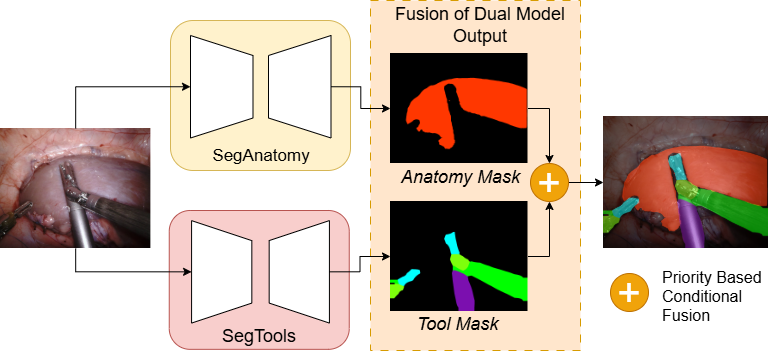

# Surg-SegFormer
This repo includes the code for Surg-SegFormer: A Dual Transformer-Based Model for Holistic Surgical Scene Segmentation: https://doi.org/10.48550/arXiv.2507.04304 <br/>



# Abstract
Holistic surgical scene segmentation in robot-assisted surgery (RAS) enables surgical residents to identify various anatomical tissues, articulated tools, and critical structures, such as veins and vessels. Given the firm intraoperative time constraints, it is challenging for surgeons to provide detailed real-time explanations of the operative field for trainees. This challenge is compounded by the scarcity of expert surgeons relative to trainees, making the unambiguous delineation of go- and no-go zones inconvenient. Therefore, high-performance semantic segmentation models offer a solution by providing clear postoperative analyses of surgical procedures. However, recent advanced segmentation models rely on user-generated prompts, rendering them impractical for lengthy surgical videos that commonly exceed an hour. To address this challenge, we introduce Surg-SegFormer, a novel prompt-free model that outperforms current state-of-the-art techniques. Surg-SegFormer attained a mean Intersection over Union (mIoU) of 0.80 on the EndoVis2018 dataset and 0.54 on the EndoVis2017 dataset. By providing robust and automated surgical scene comprehension, this model significantly reduces the tutoring burden on expert surgeons, empowering residents to independently and effectively understand complex surgical environments.


# To Run the Code


**Notes**
- Only **left camera frames** are used (`left_frames/`)
- Label masks are **single-channel PNG images**
- Mask filenames must match frame filenames
- Pixel values represent **global class ids**

The data loader is implemented in:


----------

## Classes and Label Definition

All class definitions follow the official `labels.json` file included in this repository.

**Global class IDs**
- `0`: background-tissue
- **Tool classes**: `1, 2, 3, 6, 7, 8, 9, 11`
- **Anatomy classes**: `4, 5, 10`

---

## Data Splits

This repository strictly enforces the following split policy:

- **train/** → training only
- **val/** → validation only (model selection)
- **test/** → final evaluation only

*No frames from the test set are used during training or validation.*

---

## Training Strategy

Surg-SegFormer uses a **dual-model training strategy**.

### Anatomy Segmentation Model
- Trained **only on anatomical classes**
- All tool pixels are mapped to background
- Architecture: **SegFormer MiT-B2**
- Output label space: `{background + anatomy classes}`

### Tools Segmentation Model
- Trained **only on surgical tool classes**
- All anatomy pixels are mapped to background
- Architecture: **SegFormer MiT-B5** with a custom lightweight skip-connection decoder
- Output label space: `{background + tool classes}`

Each model is trained on a **contiguous task-specific label space** for stability.

---

## Fusion at Inference

At inference time:
1. Both models generate predictions independently
2. Predictions are mapped back to **global class IDs**
3. A **priority-weighted conditional fusion operator** merges the outputs:
   - Tool predictions overwrite anatomy predictions when confidence exceeds a threshold
   - Otherwise, anatomy predictions are retained

This produces a **single holistic segmentation mask** for the surgical scene.

---

## Environment Setup
```bash
python -m venv .venv
source .venv/bin/activate        # Linux / macOS
# .venv\Scripts\activate         # Windows

pip install --upgrade pip
pip install -e .
```


## Citation

If you use this code, please cite:

Surg-SegFormer: A Dual Transformer-Based Model for Holistic Surgical Scene Segmentation
[https://doi.org/10.48550/arXiv.2507.04304](https://ieeexplore.ieee.org/document/11163962)
