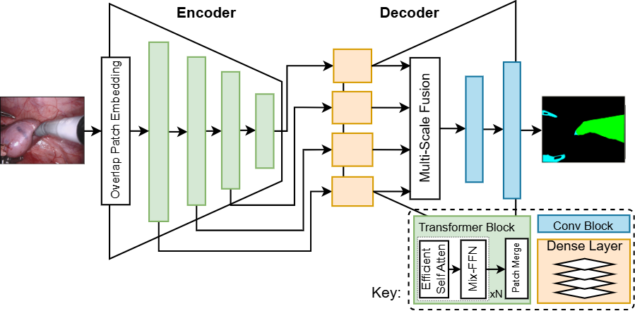

# Surg-SegFormer
This repo includes the code for Surg-SegFormer: A Dual Transformer-Based Model for Holistic Surgical Scene Segmentation: https://doi.org/10.48550/arXiv.2507.04304 

# Abstract
Holistic surgical scene segmentation in robot-assisted surgery (RAS) enables surgical residents to identify various anatomical tissues, articulated tools, and critical structures, such as veins and vessels. Given the firm intraoperative time constraints, it is challenging for surgeons to provide detailed real-time explanations of the operative field for trainees. This challenge is compounded by the scarcity of expert surgeons relative to trainees, making the unambiguous delineation of go- and no-go zones inconvenient. Therefore, high-performance semantic segmentation models offer a solution by providing clear postoperative analyses of surgical procedures. However, recent advanced segmentation models rely on user-generated prompts, rendering them impractical for lengthy surgical videos that commonly exceed an hour. To address this challenge, we introduce Surg-SegFormer, a novel prompt-free model that outperforms current state-of-the-art techniques. Surg-SegFormer attained a mean Intersection over Union (mIoU) of 0.80 on the EndoVis2018 dataset and 0.54 on the EndoVis2017 dataset. By providing robust and automated surgical scene comprehension, this model significantly reduces the tutoring burden on expert surgeons, empowering residents to independently and effectively understand complex surgical environments.

